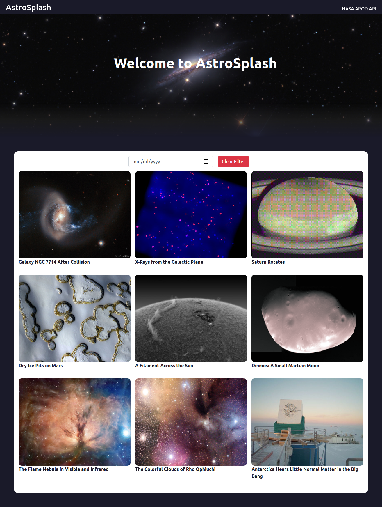

# Catalogue of Astronomy. (AstroSplash)

> AstroSplash is a web app built using React and Redux. The main goal for this project was to build a website that Fetches data from API. I have used [NASA APOD](https://api.nasa.gov/) (Astronomy Picture of the Day) API in this project to fetch the photos and other details. The project contains 2 pages, the main page, and the Detail page.
- The main/index page contains a list of photos and its title.
- The Detail page contains the single photo, title, date, and Description of the photo.
- The main/index page also contains filter functionality.
- you can filter the photos using date.

### You can access a Live Demo [HERE]( https://astro-splash.web.app)

## Built With

- React
- Redux
- Node.js
- APIs ([NASA APOD API](https://api.nasa.gov/))
- JSX
- Webpack
- HTML5
- CSS3

## Getting Started

To get a local copy up and running follow these simple steps.

- [ ] Open your terminal
- [ ]  Navigate to the directory where you will like to install the repo by running `cd FOLDER-NAME` 
- [ ] Clone this repository
 > `git clone https://github.com/Div685/NASA-Astronomy-Pictures.git`
- [ ] run `npm install`
- [ ] run `npm start`
- [ ] The `npm start` command will redirect to your default browser, and in case it doesn't redirect automatically you can go to your favorite browser and run `http://localhost:3000/`.

**Run Tests**

To run the tests follow this simple step:

- [ ] run `npm test` 

## Authors

👤 **Divyesh Patel**

- GitHub: [@Div685](https://github.com/Div685)
- Twitter: [@div_685](https://twitter.com/div_685)
- LinkedIn: [Divyesh Patel](https://www.linkedin.com/in/divyesh-daxa-patel/)

## 🤝 Contributing

Contributions, issues, and feature requests are welcome!

Feel free to check the [issues page](https://github.com/Div685/NASA-Astronomy-Pictures/issues).

## Show your support

Give a ⭐️ if you like this project!

## Acknowledgments

- I would like to thank [Marc-Antoine Roy](https://www.behance.net/enfantroy) for providing such a wonderfull [design](https://www.behance.net/gallery/11351281/NomNom). check out his other design on [Behance](https://www.behance.net/enfantroy).
- [NASA](https://api.nasa.gov/) for the NASA APOD API.
